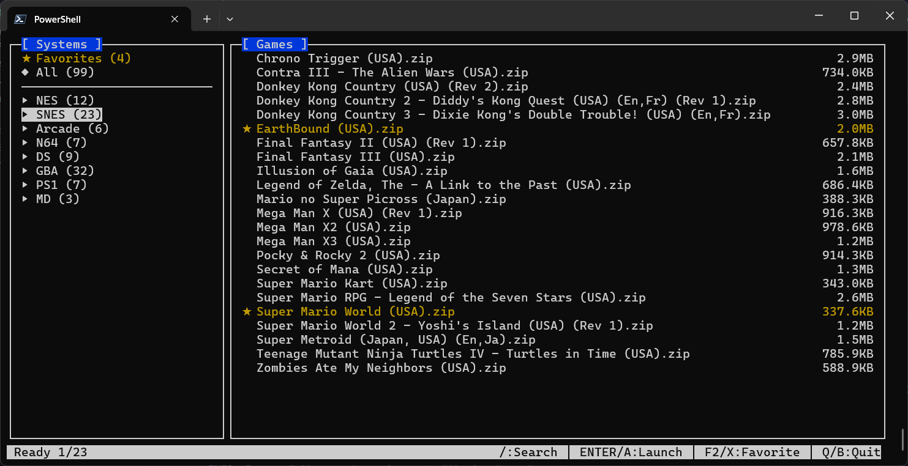

# NOBSROM - CLI ROM launcher

 *[Optional: Add actual screenshot later]*

A terminal-based game rom launcher with full gamepad support, designed for easy navigation and launching of your rom collection.

## Features

- 🕹️ **Curses-based Terminal UI** - Navigate using keyboard or gamepad
- 🎮 **Gamepad Support** - Full controller navigation with analog stick/D-pad
- ★ **Favorites** - Mark and quickly access favorite games
- 🔍 **Instant Search** - Filter games by name

## Installation

### Requirements
- Python 3.6+
- Windows/macOS/Linux

### Quick Start
```bash
# Clone repository
git clone https://github.com/yourusername/nobsrom.git
cd nobsrom

# Install dependencies
pip install -r requirements.txt

# Run the launcher
python main.py
```
## Configuration

### File Locations

- Windows: %APPDATA%\D221\nobsrom\
- macOS: ~/Library/Application Support/D221/nobsrom/
- Linux: ~/.config/D221/nobsrom/

### Example config.yaml

```yaml
systems:
  NES:
    emulator_path: "C:\\RetroArch\\retroarch.exe"
    launch_arguments: "-L cores/fceumm_libretro.dll {rom_path}"
    paths:
      - "C:\\ROMs\\NES"
      - "D:\\Backup\\NES"
  SNES:
    emulator_path: "/usr/bin/retroarch"
    launch_arguments: "-L ~/.config/retroarch/cores/snes9x_libretro.so {rom_path}"
    paths:
      - "~/ROMs/SNES"
```

## Keybindings

### Navigation

| Key          | Action                  |
| ------------ | ----------------------- |
| ↑/↓          | Move selection          |
| ←/→          | Switch between panels   |
| Enter        | Launch selected game    |

### Actions

| Key | Action             |
| --- | ------------------ |
| /   | Start search       |
| F2  | Toggle favorite    |
| Q   | Quit               |

## License

GNU General Public License 3 - see [LICENSE](LICENSE) for details

## Acknowledgments

- Python curses library for terminal UI
- pygame for gamepad input handling
- platformdirs for cross-platform config management
